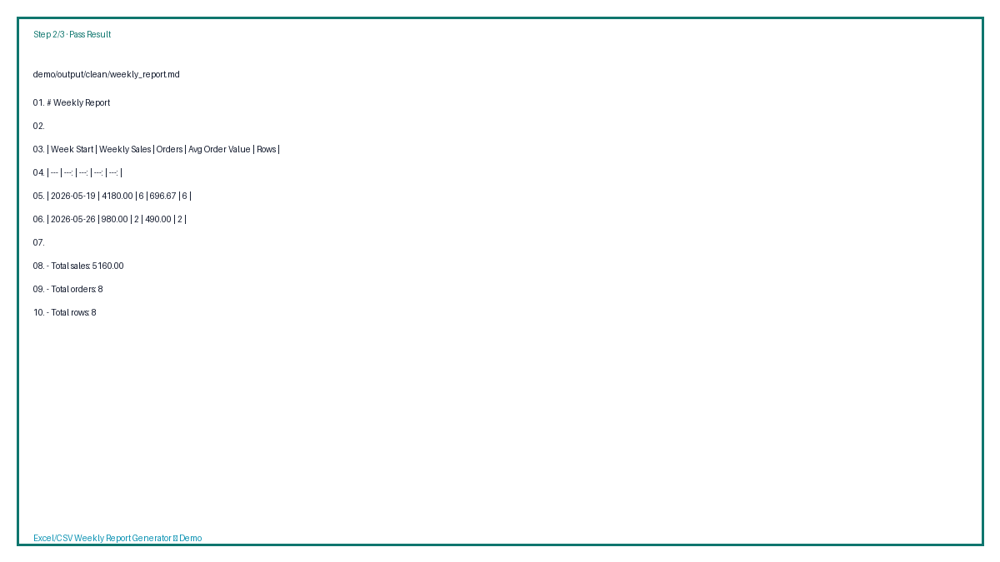
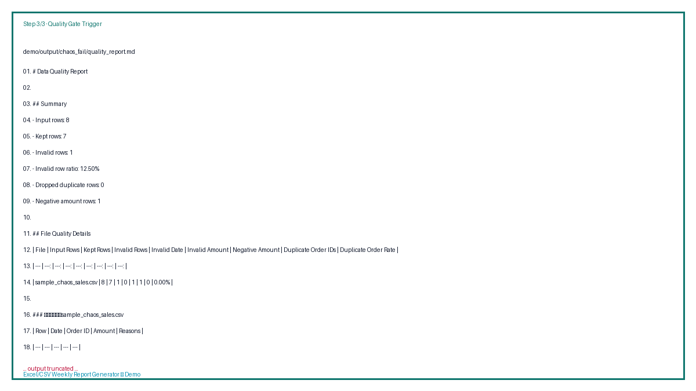
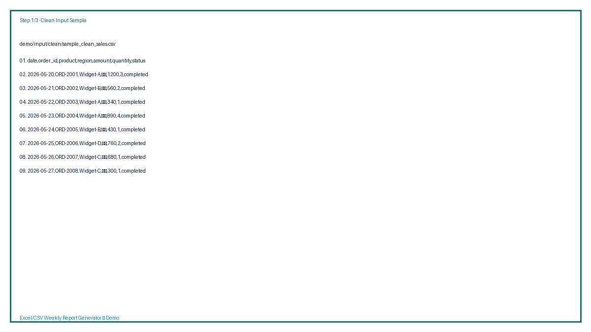

# 🧾 Excel/CSV Weekly Report Generator

可交付的表格交付 MVP：批量清洗 Excel/CSV，并自动生成每周销售周报（含数据质量告警）。目标是帮助小商家/咨询类客户在 5 分钟内完成一次标准化周报交付。  


## 作品页一眼看完（适合 GitHub 主页展示）

<p align="center">
  
  
  
  
</p>

### 立即体验

- 一次体验按钮（建议在命令行复制）  
  - `python3 -m src.weekly_report --input-dir demo/input/clean --output-dir demo/output/clean`
- 一次告警体验按钮（用于质检演示）  
  - `python3 -m src.weekly_report --input-dir demo/input/chaos --output-dir demo/output/chaos_fail --max-invalid-row-rate 0.05 --max-duplicate-order-rate 0.01 --fail-on-quality`
- 对外可贴：直接把 `demo/input/*` 与 `demo/output/*` 链接到 README（已内置）

### 🚀 Launch Demo

- [一键体验（清洗通过版）](#0-安装)
- [一键体验（告警版）](#2-再跑告警版-触发质量红线)
- [演示视频 / GIF（作品页）](./demo/showcase/demo-video.md)
- [演示素材目录](./demo)
- [Showcase 说明](./demo/showcase/README.md)

### 公开展示结构（模板）

你可以直接在项目首页展示以下 5 项：

1. 项目定位（3 秒看懂）
2. 快速复现命令（1 次复制即可）
3. 通过版/告警版输出对照
4. 收费口径（按次 / 按文件 / 按门店）
5. 常见问题（减少售前解释成本）

### GitHub 作品页可直接粘贴代码块

```markdown


- [5分钟快速体验](#5-分钟上手公开演示最小样例)
- [演示素材目录](./demo)
```

> `demo-workflow.gif` 当前为项目内生成的演示 GIF。后续可替换为你录制的 CLI 录像 GIF 或视频。

## 特性
- 批量读取 `.csv`, `.xlsx`, `.xls`
- 自动字段映射（`field-map.json`）+ 多客户 profile
- 日期/金额解析与基础清洗
- 重复订单号去重
- 生成周报：`weekly_report.csv/.md`
- 数据质量报告：`quality_report.json/.md`
- 可配置质量阈值与 `--fail-on-quality` 质量闸门（适配自动交付流水线）

## 可卖交付版本（面向客户展示）

- 目标交付对象：小商家、独立咨询师、服务型团队、财务/运营外包
- 交付形式：脚本一键复现 + 结果文件 + 质量告警说明
- 建议售价：先用演示素材验证价值，再按你的服务策略分层定价（下文给了可直接粘贴的定价模板）

### 费用口径（样例）

| 套餐 | 计费口径 | 适配场景 | 参考起价（示例） |
| --- | --- | --- | --- |
| 标准交付 | 按次 | 1~3 个文件，单次报表输出 | 299 元/次 |
| 文件包 | 按文件数 | 4~20 个文件，按量计费 | 19 元/文件 |
| 门店月包 | 按门店+月度 | 固定门店周报，含异常复核 | 899 元/店/月 |

### 交付说明（可直接写给客户）

- 你提交：原始 Excel/CSV（支持多个文件）
- 我方交付：
  - `cleaned_rows.csv`（清洗明细）
  - `weekly_report.csv/.md`（标准周报）
  - `quality_report.json/.md`（质检结论与异常样例）
- 质量条款：触发红线则先给出“问题样例 + 处理建议”，并保留失败证据；补齐源数据后可重跑交付。
- 可选增值：字段映射定制、模板化交付文案、按店铺口径二次聚合。

## 5 分钟上手（公开演示最小样例）

### 0) 安装
```bash
cd /Users/zhoufangming/Developer/learning/sellable-delivery-bootcamp
python3 -m venv .venv
source .venv/bin/activate
python3 -m pip install -r requirements.txt
```

### 1) 先跑“通过版”样例（1-3 秒）
```bash
python3 -m src.weekly_report \
  --input-dir demo/input/clean \
  --output-dir demo/output/clean
```

预期结果：
- `demo/output/clean/weekly_report.md`（可直接发客户）
- `demo/output/clean/quality_report.md`（质量报告）

### 2) 再跑“告警版”（触发质量红线）
```bash
python3 -m src.weekly_report \
  --input-dir demo/input/chaos \
  --output-dir demo/output/chaos_fail \
  --max-invalid-row-rate 0.05 \
  --max-duplicate-order-rate 0.01 \
  --fail-on-quality
```

预期行为：返回非 0 退出码（示例中会显示 `invalid_row_ratio=12.50% > threshold=5.00%`），用于触发交付方的数据质量复核流程。

## 示例对照（你可以直接粘贴到客户说明里）

| 场景 | 输入 | 关键参数 | 产物 | 交付含义 |
| --- | --- | --- | --- | --- |
| 通过版 | `demo/input/clean/sample_clean_sales.csv` | 默认阈值 | `demo/output/clean/` | 报表可直接输出 |
| 告警版 | `demo/input/chaos/sample_chaos_sales.csv` | `--max-invalid-row-rate 0.05` + `--fail-on-quality` | `demo/output/chaos_fail/`（文件仍会生成） | 质量红线阻断，提醒客户修复源数据 |

## 输出清单（每次运行）
运行后会在 `--output-dir` 下生成：
- `cleaned_rows.csv`：清洗后明细表
- `weekly_report.csv`：周维度聚合表
- `weekly_report.md`：可读周报
- `quality_report.md`：中文可读质检报告（含异常样例）
- `quality_report.json`：结构化质检结果（适合自动化汇总）

## 字段映射（客户化）

基础映射文件默认是 `field-map.json`，支持多个 profile：

```bash
python3 -m src.weekly_report --map-profile cn_ops_template_a
```

若你有真实客户字段名，可复制并修改：

```bash
python3 -m src.weekly_report \
  --field-map field-map.<client>.json \
  --map-profile <client>
```

支持一键多客户交付包：

```bash
python scripts/client_delivery_pack.py create sample-client
python scripts/client_delivery_pack.py run sample-client
```

## 公开展示素材（已内置）

完整可复用素材在 `demo/`：
- `demo/input/clean/*`：正常样本输入（通过版）
- `demo/input/chaos/*`：脏数据样本（告警版）
- `demo/output/clean/*`：通过版输出
- `demo/output/chaos_fail/*`：告警版输出（附失败日志）

## 演示截图 / GIF（展示页级打磨）

- 先按 `demo/showcase/README.md` 做三图一文案：
  - 图 1：输入样本快照（clean）
  - 图 2：通过版周报输出（clean）
  - 图 3：质量告警样本（chaos）
- 预期增加 1 段 8~12 秒 GIF，展示“通过版 -> 告警版”的完整链路
- 当前仓库已放入 `demo/showcase/assets/` 的第一版展示图；后续可替换为你更高质量的终端截图/GIF。

## 常见问题

### 为什么我没看到某些字段？
当前映射优先按 `field-map.json` 的 `profiles` 匹配 `date/amount/order_id`。可按你的文件命名新增同义词并提交。

### 什么情况下会触发 `--fail-on-quality`？
当 `invalid_row_ratio` 或重复订单率超过阈值时，脚本会直接 `exit 1`，适合与客户交付前的质检闸门对接。

### 可以改成按门店/文件分账？
可以。后续可加 `client_name/store` 列聚合，但当前版本已保持最小可交付，便于快速上手和演示。

## 本地回归测试
```bash
python3 -m pip install pytest
python3 -m pytest -q
```

## 已完成口径
- 周报按 ISO 周（周一起点）聚合
- 统计指标：周销售额、订单数、客单价、行数
